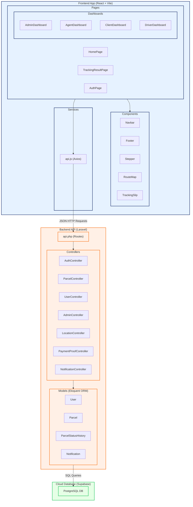
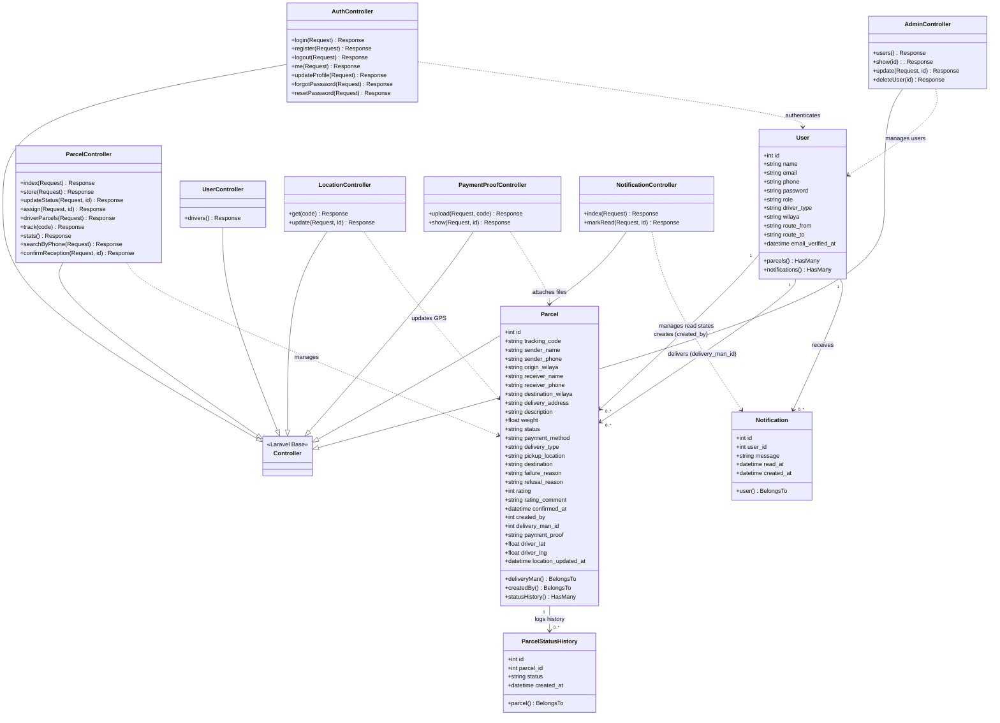

# DeliverIt – Mermaid Diagram Code

This document provides the complete Mermaid code for the **Package Diagram** and **Class Diagram** representing the **DeliverIt** architecture. You can render these diagrams natively on GitHub, in Obsidian, or using online editors such as [mermaid.live](https://mermaid.live).

---

## 1. Package Diagram (Architecture Flowchart)

The package diagram shows the high-level decoupled architecture of the platform. It separates the frontend user interface, backend server routing/business logic, and cloud database storage.

---

## 2. Class Diagram

The class diagram maps the backend logic structure. It depicts the standard Laravel base controller extension hierarchy, user models, parcel models, notification models, and their respective relationships.

