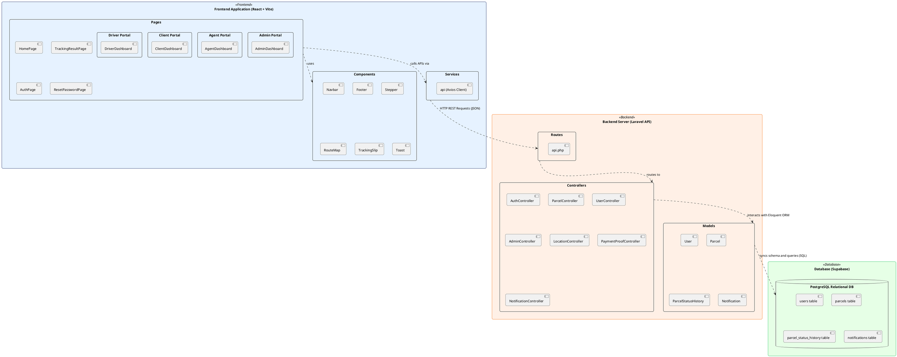
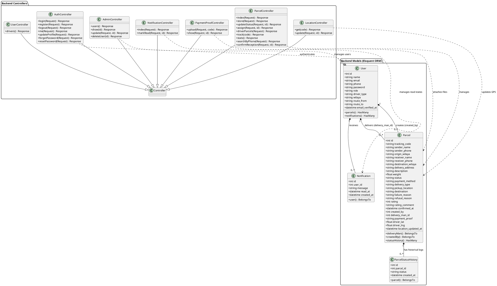

# DeliverIt – PlantUML Diagram Code

This document provides the complete PlantUML code for the **Package Diagram** and **Class Diagram** representing the **DeliverIt** architecture. You can render these diagrams using online PlantUML viewers (like [planttext.com](https://www.planttext.com) or [plantuml.com/plantuml](http://www.plantuml.com/plantuml)) or by using the PlantUML VS Code extension.

---

## 1. Package Diagram

The package diagram shows the high-level decoupled architecture of the platform. It separates the frontend user interface, backend server routing/business logic, and cloud database storage.

---

## 2. Class Diagram

The class diagram maps the backend logic structure. It depicts the standard Laravel base controller extension hierarchy, user models, parcel models, notification models, and their respective relationships (multiplicities).

